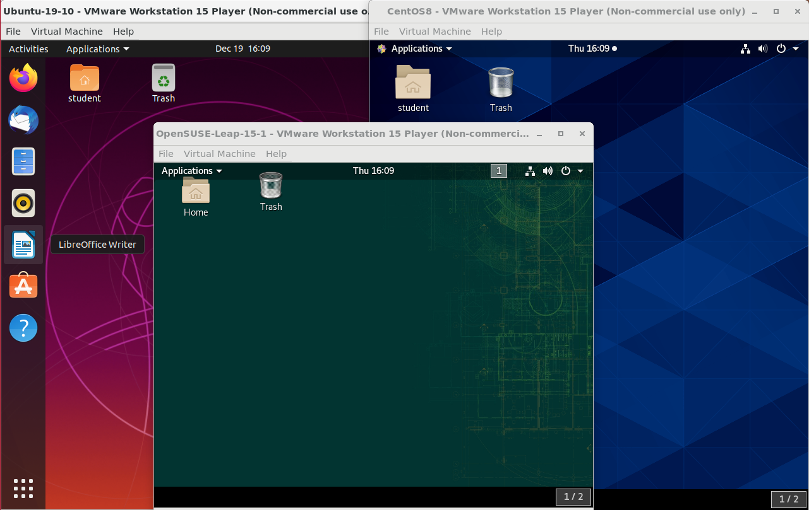
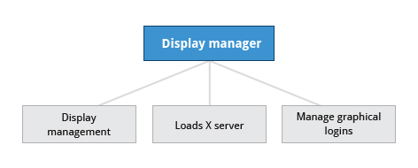
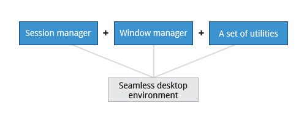
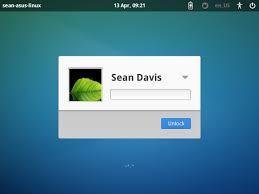
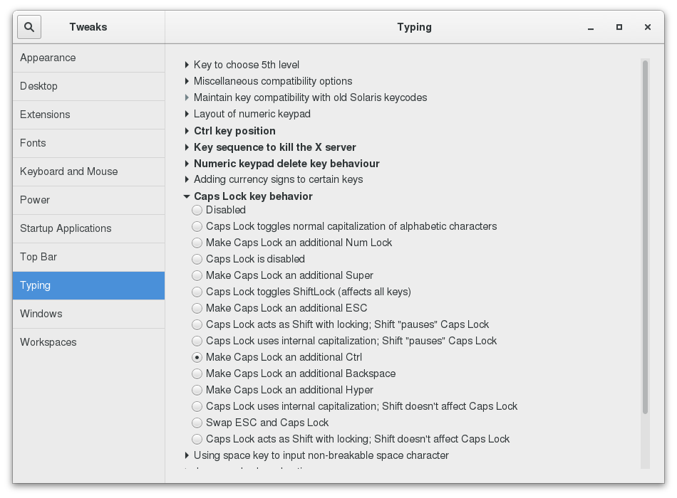

<style>
img[alt~="center"] {
  display: block;
  margin: 0 auto;
}
</style>

# <!-- fit --> Interface graphique

- A.Belcaid

---

<!-- _font-size:40px -->
## Appercu

- Gérer des interfaces graphiques (**GUI**)
- Réaliser des opérations simples avec GUI.
- Changer son gestionnaire graphique.


---
## Bureau Graphique (Graphical Desktop (DE))


En **linux**, on peut travailler soit avec:

- Invité de commandes (*Command Line Interface* CLI)

Puissance de manipulation, mais nécessite de retenir des **commandes** et une maniere d'obtenir des informations sur ces commandes.

- Interface graphique (Graphical User Interface GUI) 

Acces plus simple a des operations basiques.


---

## Distrubutions 

On va apprendre a **gérer** une *session* GUI des distributions classiques:

- Debian ( Ubunut, Mint)
- Red Hat (CentOS, Fedora)
- SUSE ( open SUSE)
- Arch ( manjaro, PopOS)




--- 

## Desktops

On va aussi principalement l'espace de travail [Gnome](https://www.url.com).

Vous pouvez utiliser d'autres (DE) comme:

<!-- _font-size:20px -->

- [KDE](https://tecadmin.net/best-linux-desktop-environments/)
- Budgie
- LXQt
- XFCE
- LXDE


---

## Système X 

Dans une distribution Linux, le système [X Window](https://fr.wikipedia.org/wiki/X_Window_System) est chargé comme la **dernière** étape du processus de chargement (**boot**).

> Un service appelé **Display Manager** charge le serveur **X** et garde une trace des moniteurs attache au système.

> Il s'occupe aussi du système de connexion et de charger le DE.

---

## Système X

> X est très vieux (1980), il est remplace graduellement par [Wayland](https://wayland.freedesktop.org/). 



---

## Système X



Un (DE) consiste de:

- Gestionnaire de session:  Gère les composantes graphiques.

- Gestionnaire de fenêtre (WM): Contrôle le placement des fenêtres.

---

## Combinaison

- On peut mixer Un gestionnaire de session avec un autre **WM**.

- > Si le gestionnaire d'affichage n'est pas lancé par défaut. On peut l'exécuter manuellement.

```bash
startx        #lance le service x
gdm           # Getionnaire de session gnome
kdm           # Getionnaire de session kde
xdm           # Getionnaire de session xfce
lightdm       # Gestionnaire leger
```

---

## Démarrage GUI


Quand vous installer un (DE), le gestionnaire de session **X** vous propose:

- Choisir votre session (Gnome, KDE, ...)
- Charger toute les composantes graphiques.


---

## Gnome


[Gnome](https://www.gnome.org/) est le (DE) le plus populaire de linux.

- DE par défaut de plusieurs distribution (RHEL, SUSE, KALI)
- Basé sur la bibliothèque [GTK](https://www.gtk.org/)
- Version actuelle **4.2**.


---

## Gnome-tweaks


> Le système par de configuration par défaut de gnome est limite. Surcout si on veut changer des options avancées.

- **Gnome-tweaks** expose plus d'options.

- Offre aussi la possibilité d'installer des **extensions**.


---

## Connexion/Déconnexion


Linux est un système **multi utilisateur**. Il permet a plusieurs utilisateurs
d'être connecté **en même temps**

- Personnalisation pour chaque utilisateur.
- Garde les sessions ouvertes pour chaque utilisateur.
 

---

## Étendre/Redémarrage


- On peut utiliser le système graphique pour **étendre** ou **redémarrer** la
machine.

- Cependant on peut utiliser aussi le **shell**:


```
sudo shutdown -h now   # Ettendre maintenant
sudo shutdown -r now   # Redemarrer maintenant
sudo shutdown -r +5    # redemarer apres 5 minutes
sudo shutdown -h 13:00 # Ettendre a 13:00
```

--- 

## Suspendre

Tous les ordinateurs modernes support la **suspension**(sleep). Cette option permet de mettre l'ordinateur en etat de repos avec la possibilité de **résumer** le travail.

Dans cet état, le système garde tous les programmes dans la **RAM** et entre dans un mode d'économie d'énergie.


On peut suspendre le système soit par GUI, soit par:

```bash
sudo systemctl suspend  
```

