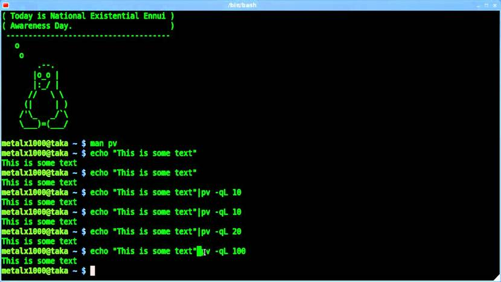

<style>
img[alt~="center"] {
  display: block;
  margin: 0 auto;
}
</style>

# <!-- fit --> Introduction a Linux

- A.Belcaid

---

<!-- _font-size:40px -->
## Appercu

-  Logistiques
- Introduction au shell
- Définition de Linux 
- Logiciel libre est open source.

---
## Logistiques du cours

> Toutes les informations concernant la logistique du cours sera dans la page [Logistique](http://127.0.0.1:4000/logistics/)

---


## introduction au shell


- **C'est quoid le Shell**: Un invite de commande *(CLI)* pour interagir avec le système d'exploitation.

Au début de l'informatique les **shell** était la seule interface utilisateur disponible sur un système de type **linux/unix**.





---

Les systèmes d'exploitation de type **Unix** disposent le plus souvent d'un shell. A l'origine, l'`interpreteur par defaut` est [sh](https://fr.wikipedia.org/wiki/Bourne_shell) qui donnera naissance a plusieurs **variantes**

- [csh](https://fr.wikipedia.org/wiki/Csh) : C Shell qui représente un évolution
de sh avec une syntaxe plus proche de `C`.

- [bash](https://fr.wikipedia.org/wiki/Bourne-Again_shell): Bourse-Again Shell est le shell du projet **GNU**.

- [Zsh](https://fr.wikipedia.org/wiki/Z_Shell) : Implantation similaire a **bash** mais avec plusieurs améliorations.


---

## Demo (1/3)

- **Lancer un terminal**

- Exécuter `neofetch`

> Montrer les caractéristiques de son système.

- Gestion de **fichiers**.
> Création, déplacent et suppression de fichiers.
    - `ls` : lister le contenu
    - `cd`: pour ce déplacer.
    - `ls -a` : lister tout.

---

## Demo (2/3)

- Édition fichier:
    - `vim`
    - `nano`
    - `emacs`

- Montrer un contenu:
    - `cat`

---

### Demo (3/3)


- Obtenir le manuel:
    - `man`
        - **Navigation**

- Ressources du système:
    - `htop`


---

## Commandes Bash

- Structure basique d'une commande

```shell
[command] [flags] [arguments]
```

-  Besoin d'aide:
     - Utiliser `man`
     - outil plus simple `tldr`

En fin de compte **Google** est votre meilleur ami!.

---

## Commandes utiles:

- `cd` : changer le répertoire courant.
- `ls`: lister le contenu du dossier.
- `cat`: concaténer et afficher les fichiers.
- `head`: montrer les premiers 10 lignes d'un fichier.
- `mv`: déplacer des fichiers
- `cp`: copier des fichiers
- `rm`: Supprimer des fichiers.

---

# C'est quoid Linux


[linux](https://fr.wikipedia.org/wiki/Linux) est une famille de systèmes
d'exploitation **open source**.

- Il est fondé sur le noyau **linux** crée en **1991** par `Linus Trovalds`.

- Premièrement conçu pour des machines **compatible PC**.

Maintenant occupe plus que **80%** des serveurs.
 
---

<!-- _backgroundColor: white -->
<!--  -->


---

## Logiciel libre et open source

 **Free Open Source Software** (FOSS) s'applique aux logiciels dont  la licence respecte *précisément respectées* par [Open source Initiative](https://fr.wikipedia.org/wiki/Open_Source_Initiative).

    - Possibilité libre de redistribution
    - Accès au code source initial du projet.
---

## GNU et le mouvement de logiciel libre

> So that I can continue to use computers without violating my principles, I
have decided to put together a sufficent body of free software so that I will be able to get along without any software that is not free

Richard Stallman (1983)


---

## Les quatres principes


1. La liberté d'**exécuter** votre programme pour n'importe quelle tache.
2. La liberté d'**étudier** et **modifier** le programme a votre souhait. 
    > L'access au code source devient automatique.
3. La liberté de **distribuer** des copies.
4. La liberté de distribuer des copies **modifiées**

> [What is Free Software](https://www.gnu.org/philosophy/free-sw.html) : Article par la fondation (FOSS).

---

### Berkeley Standard Distribution


La [Distribution Berekeley](https://fr.wikipedia.org/wiki/Berkeley_Software_Distribution) ou `BSD` est un **dérivée** de Linux Créée a **Berkeley**.

- Très populaire et **fiable**. Plusieurs aspects de **BSD**
    - vi
- Plusieurs dérivatives très populaires:
    - `Mac Os`
    - `FreeBSD`
    - `OpenBSD`


----

## Avantages Linux

 Philosophie : Simple, Short, Clear et code modulaire.
- Approche modulaire:
> Everything is a file
    - Une fichier `.txt` est un fichier.
    - Un processeur du systeme est un **fichier**.
    - Memoire vive est un **fichier**.

- Worse is better? (Do one thing but doing it well)

--- 
## Avantages du (FOSS)

- Securite
- Cout ( It'f free)
- Privacy
- Controle : choix municieux des composantes installes.
- Collaboration

---

##  Lisences OSS


- [GPL](https://fr.wikipedia.org/wiki/Licence_publique_g%C3%A9n%C3%A9rale_GNU):
Licence publique générale.
> I want to make all the versions of GNU remains free. R.Stallman

- Permissive ( MIT, BSD, APACHE, ...)

    >Faites ce que vous voulez avec.
- [https://choosealicense.com/licenses/](https://choosealicense.com/licenses/)
